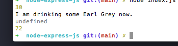

# node-express-js

## Initializng 'node package modules'

Creating package.json for our project

```text
npm init -y
```
## Craeting Files to link later
```text
touch index.js myModules.js
```

## Creating Functions in our myModuls.js to later use in our index.js file
```js
function addTen(num){
    let result = num+ 10;
    return result;
}

function drinkTea(tea){
   console.log(`I am drinking some ${tea} now.`);
}

function multiply(num1, num2){
    let result = num1 * num2;
    return result;
}
```

## Exporting our functions
```js
module.exports = {
    addTen,
    drinkTea,
    multiply
}
```
## Importing our functions into Index.js

```js
const {addTen, drinkTea, multiply} = require("./myModules");
```

## Calling on our functions in index.js
```js
console.log(addTen(20));

console.log(drinkTea('Earl Grey'));

console.log(multiply(9,8));
```
## Running our function with Node
```tex
node index.js
```
## Confirming it worked
;